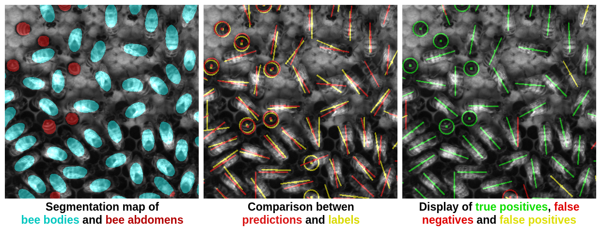

Segmentation-based bee detection
================================

This repository contains code and instructions for a segmentation based object detection method, initially developed for a beehive environment and described here: [Towards Dense Object Tracking in a 2D Honeybee Hive](http://openaccess.thecvf.com/content_cvpr_2018/html/Bozek_Towards_Dense_Object_CVPR_2018_paper.html).

The repository is prepared for the beehive dataset available on [this webpage](https://groups.oist.jp/bptu/honeybee-tracking-dataset). The model is also a simplified version of the one used in the paper : single frame only, no gaussian weights, smaller resolution.


## Requirements
- Python 3.5+
- [TensorFlow](https://www.tensorflow.org/) (Tested on 1.12)
- [OpenCV](https://opencv.org/)
- [Numpy](http://www.numpy.org/)

## Run training and prediction for the beehive dataset
Download one of the two bee datasets available, for example the 30 fps one:   
30 fps: [images](https://beepositions.unit.oist.jp/frame_imgs_30fps.tgz), [annotations](https://beepositions.unit.oist.jp/frame_annotations_30fps.tgz)  
70 fps: [images](https://beepositions.unit.oist.jp/frame_imgs_70fps.tgz), [annotations](https://beepositions.unit.oist.jp/frame_annotations_70fps.tgz)

Create an empty folder to uncompress the two files, the resulting file structure should look like:  
```
dataset
+-- frames  
|   +-- *.png  
+-- frames_txt  
|   +-- *.txt  
```

You can train the model by passing as an argument the path to your dataset root folder:

`python3 train.py path_to_dataset`

A subset of the images will be separated for testing (parameter --validation_num_files). You can observe that the loss value decreases with time.

After training you can predict the results on the test set by running:

`python3 predict.py path_to_dataset`

The results will be stored in a new `predict_results` folder. For each input frame, three images will be generated :  


An aggregate results file of error metrics for all test images is also created : `average_error_metrics.txt`.


## To adapt to another dataset

To predict on a new dataset, you can use the script `predict_template.py`, by replacing the function `predict_data_generator` to load your own dataset.

To train on a new dataset, you can use the script `train_template.py` by replacing the functions `train_data_generator` and `eval_data_generator` (generate a pair of images image_data, label_data).  

The labels for the beehive dataset were created using a custom [tool](https://github.com/oist/DenseObjectAnnotation).

## Contact

If you have any questions about this project, please contact:  
laetitia.hebert at oist.jp  
kasia.bozek at oist.jp  
